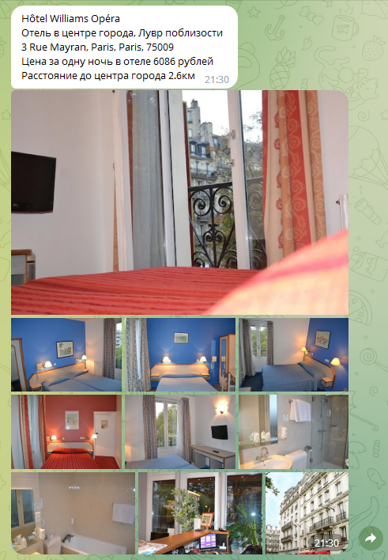

# Help To Find Hotels

> Для начала нужно присоединиться к боту: https://t.me/HelpToFindHotelsBot

> Чтобы начать пользоваться, нужно отправить команду /start

> /lowprice выдаст топ самых дешевых отелей
>
> /highprice выдаст топ самых дорогих отелей
> 
> /bestdeal выдаст наиболее дешевые варианты отелей, расположенные ближе всего к центру города
>
> /history выдаст историю поиска отелей

> Введем команду /lowprice и введем город

> На сайте hotels.com нашлось два города. Выберем первый вариант.

> Максимум API сайта hotels.com может отобразить 200 отелей. Но бесплатная версия имеет ограничение - 500 запросов в месяц.
> 
> В календаре выберем дату заезда и выезда

> Выберем первый вариант

> Можно ввести огромное число, но бот выдаст только максимум фото, которые найдет. Можно ввести меньше того числа фото, которого нашел бот. Тогда будет показано количество фото, которое хочет получить пользователь.

> Бот вывел результат:

